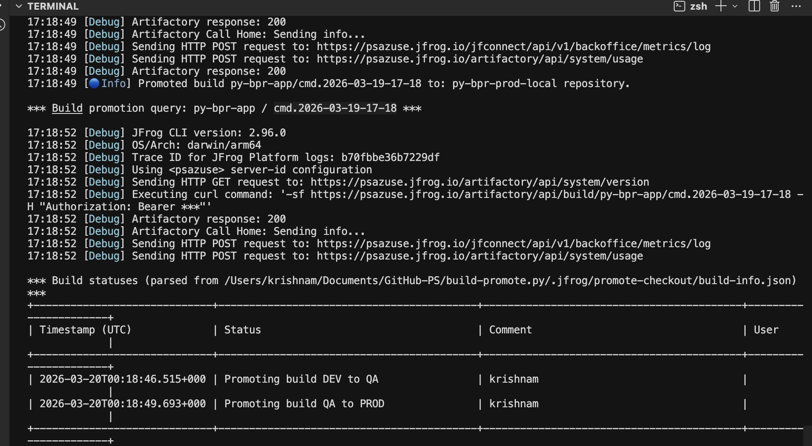
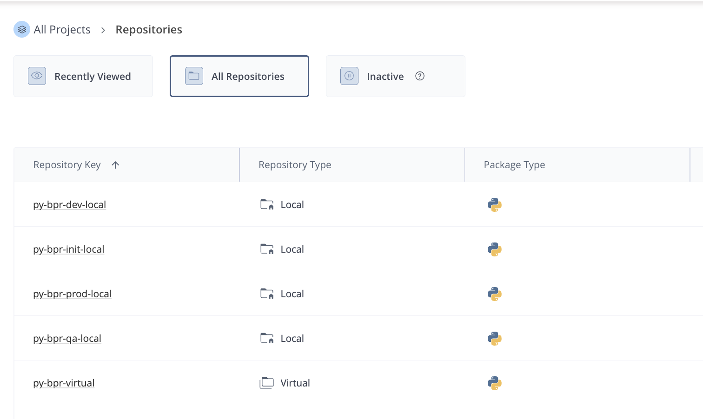
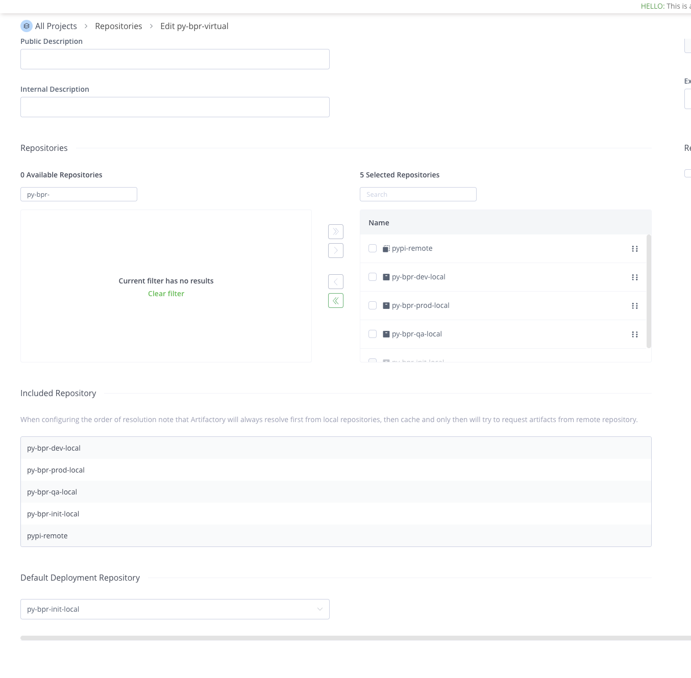
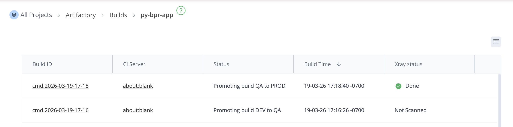
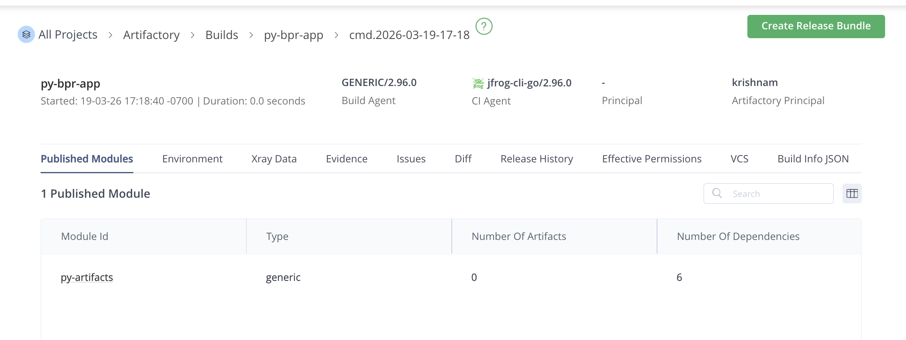
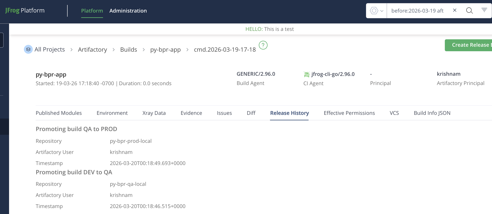

# build-promote.py

### Build & Promote
```
    ./jfcli.sh
```


#### Artifactory screens


<br>

<br>

<br>

<br>

<br>


## References
- JF CLI: https://docs.jfrog.com/artifactory/docs/build-integration#promoting-a-build
- API: https://docs.jfrog.com/artifactory/reference/promotebuild